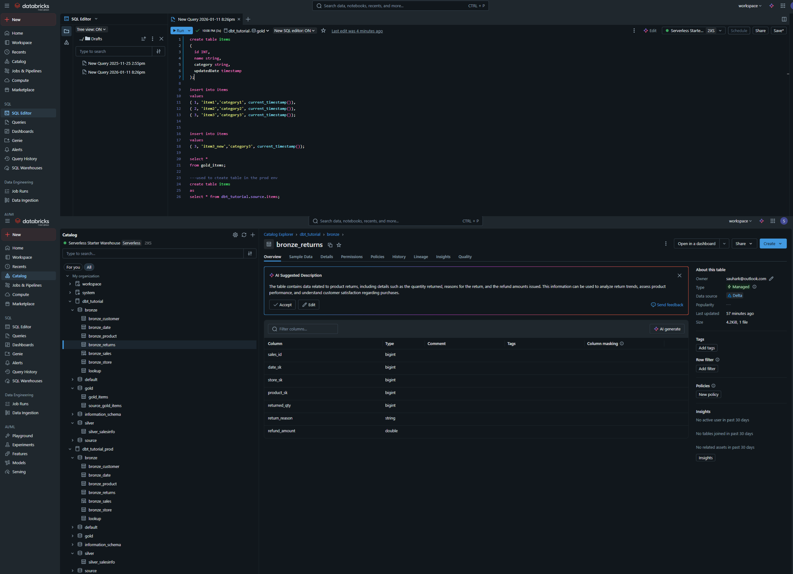
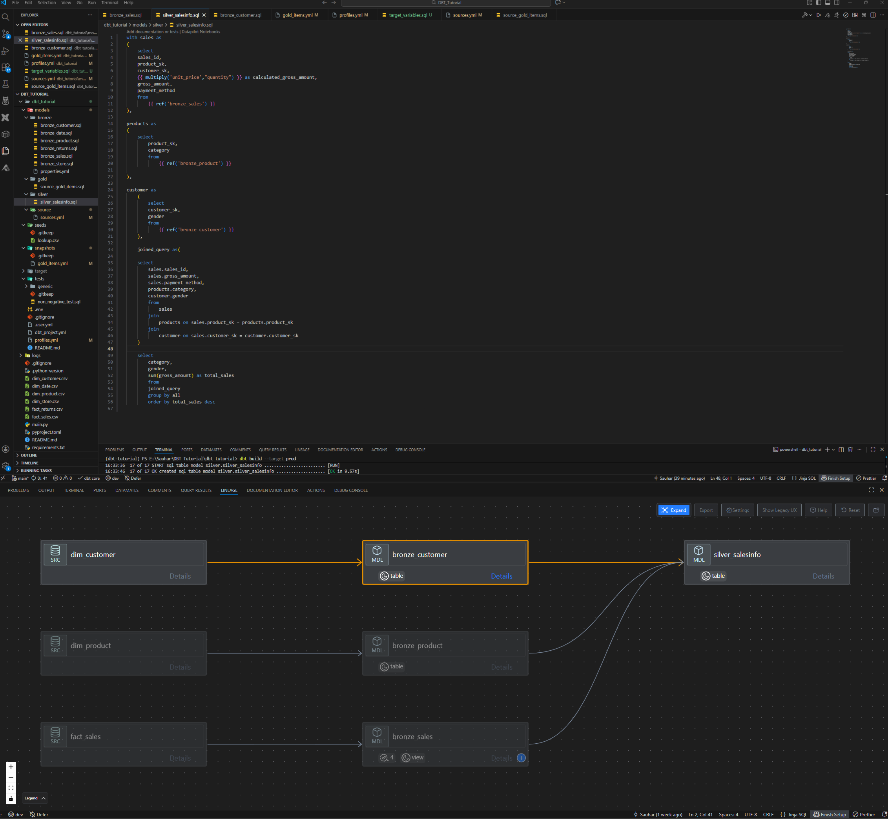

# dbt Tutorial - Retail Data Warehouse

A complete **dbt + Databricks** project 
---

## Overview

This project demonstrates how to build a **production-ready retail analytics data warehouse** using modern data engineering practices.

**What it does:**
- Transforms raw retail data into a dimensional model
- Implements Star Schema with fact and dimension tables
- Enables business analytics on sales, returns, customers, products, and stores

**Tech Stack:**
- **dbt Core** — SQL-based data transformation
- **Databricks** — Cloud data platform
- **Delta Lake** — Storage format with ACID transactions

---

## Data Model
```
                           ┌──────────────┐
                           │   dim_date   │
                           └──────┬───────┘
                                  │
┌──────────────┐          ┌───────┴───────┐          ┌──────────────┐
│ dim_customer │◄─────────│  fact_sales   │─────────►│ dim_product  │
└──────────────┘          └───────┬───────┘          └──────────────┘
                                  │
                           ┌──────┴───────┐
                           │  dim_store   │
                           └──────────────┘

                          ┌───────────────┐
                          │ fact_returns  │
                          └───────────────┘
```

| Table | Type | Description |
|-------|------|-------------|
| `dim_customer` | Dimension | Customer attributes (name, segment, region) |
| `dim_product` | Dimension | Product catalog (name, category, price) |
| `dim_store` | Dimension | Store locations (city, state, type) |
| `dim_date` | Dimension | Calendar attributes (day, month, year) |
| `fact_sales` | Fact | Sales transactions (quantity, amount) |
| `fact_returns` | Fact | Return transactions (quantity, refund) |

---

## Project Structure
```
dbt-tutorial/
├── dbt_tutorial/           # dbt project
│   ├── models/
│   │   ├── staging/        # Clean raw data
│   │   ├── intermediate/   # Business logic
│   │   └── marts/          # Final dimensional model
│   ├── seeds/              # CSV source data
│   ├── tests/              # Data quality tests
│   └── dbt_project.yml     # Configuration
│
├── dim_customer.csv        # Customer data
├── dim_product.csv         # Product data
├── dim_store.csv           # Store data
├── dim_date.csv            # Date data
├── fact_sales.csv          # Sales data
├── fact_returns.csv        # Returns data
├── main.py                 # Python script
├── requirements.txt        # Dependencies
└── README.md
```

---

## Getting Started

### Prerequisites

- Python 3.13.5
- Databricks account with SQL Warehouse
- Databricks Personal Access Token

### Installation
```bash
# Clone repository
git clone https://github.com/sauhar/dbt-tutorial.git
cd dbt-tutorial

# Create virtual environment
python -m venv venv
source venv/bin/activate  # Windows: venv\Scripts\activate

# Install dependencies
pip install -r requirements.txt
```



### Configuration

Create `~/.dbt/profiles.yml`:
```yaml
dbt_tutorial:
  target: dev
  outputs:
    dev:
      type: databricks
      catalog: your_catalog
      schema: dbt_retail
      host: your-workspace.cloud.databricks.com
      http_path: /sql/1.0/warehouses/your-warehouse-id
      token: "{{ env_var('DATABRICKS_TOKEN') }}"
```

Set environment variable:
```bash
export DATABRICKS_TOKEN=your_token
```

### Run the Project
```bash
cd dbt_tutorial

# Verify connection
dbt debug

# Load seed data
dbt seed

# Run models
dbt run

# Run tests
dbt test

# Generate docs
dbt docs generate && dbt docs serve
```

---

## dbt Commands

| Command | Description |
|---------|-------------|
| `dbt seed` | Load CSV files into database |
| `dbt run` | Execute all models |
| `dbt test` | Run data quality tests |
| `dbt build` | Seed + run + test |
| `dbt docs generate` | Generate documentation |
| `dbt docs serve` | View docs in browser |

---
https://github.com/sauhar/dbt-tutorial/blob/master/databricks.png

## Sample Query
```sql
-- Sales by product category
SELECT 
    p.category,
    SUM(f.quantity) AS units_sold,
    SUM(f.total_amount) AS revenue
FROM fct_sales f
JOIN dim_product p ON f.product_id = p.product_id
GROUP BY p.category
ORDER BY revenue DESC;
```

---

